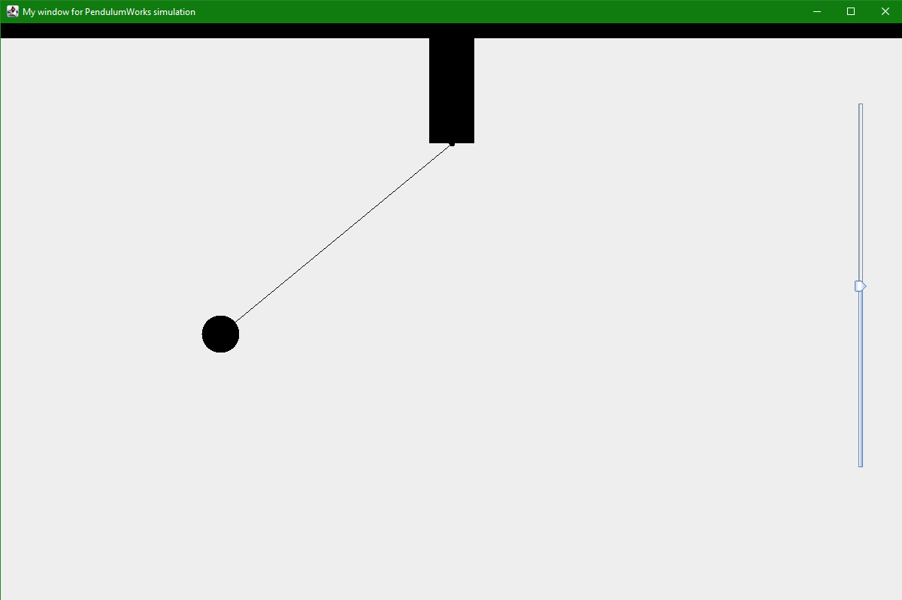

# Pendulum-Simulation
Simulation of working pendulum    
## How to use
To clone and run this application, you'll need JDK installed on your computer.  
You can change the length of arm using slider and you can drag the ball in 'x' position using your mouse.  
Below you have a screenshot where you can see how it is done.  
   
## Technologies
* Java 15
